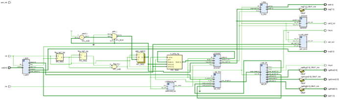
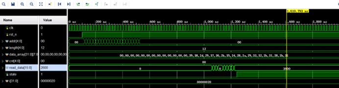

**English | [简体中文](README_cn.md)**
<div id="top"></div>

[![Contributors][contributors-shield]][contributors-url]
[![Forks][forks-shield]][forks-url]
[![Stargazers][stars-shield]][stars-url]
[![Issues][issues-shield]][issues-url]
[![License][license-shield]][license-url]


<!-- PROJECT LOGO -->
<br />
<div align="center">
    <a href="https://github.com/MoonGrt/FPGA-Calculator">
    
    </a>
<h3 align="center">FPGA-Calculator</h3>
    <p align="center">
    A calculator capable of calculating any four-pronged equation with brackets.
    <br />
    <a href="https://github.com/MoonGrt/FPGA-Calculator"><strong>Explore the docs »</strong></a>
    <br />
    <br />
    <a href="https://github.com/MoonGrt/FPGA-Calculator">View Demo</a>
    ·
    <a href="https://github.com/MoonGrt/FPGA-Calculator/issues">Report Bug</a>
    ·
    <a href="https://github.com/MoonGrt/FPGA-Calculator/issues">Request Feature</a>
    </p>
</div>


<!-- CONTENTS -->
<details open>
  <summary>Contents</summary>
  <ol>
    <li><a href="#file-tree">File Tree</a></li>
    <li>
      <a href="#about-the-project">About The Project</a>
      <ul>
      </ul>
    </li>
    <li><a href="#contributing">Contributing</a></li>
    <li><a href="#license">License</a></li>
    <li><a href="#contact">Contact</a></li>
    <li><a href="#acknowledgments">Acknowledgments</a></li>
  </ol>
</details>


<!-- FILE TREE -->
## File Tree

```
└─ Project
  ├─ LICENSE
  ├─ README.md
  ├─ /calculator.cache/
  ├─ /calculator.hw/
  ├─ /calculator.ip_user_files/
  ├─ /calculator.runs/
  ├─ /calculator.sim/
  ├─ /calculator.srcs/
  │ └─ /sources_1/
  │   ├─ /imports/
  │   │ └─ /new/
  │   │   └─ divclk.v
  │   └─ /new/
  │     ├─ debounce_sw.v
  │     ├─ process.v
  │     ├─ process1.v
  │     ├─ uartsend.v
  │     ├─ uart_send.v
  │     ├─ v1.v
  │     ├─ vga_disp.v
  │     ├─ vga_dri.v
  │     ├─ v_ajxd.v
  │     └─ v_disp1.v
  └─ /Document/images/
```


<!-- ABOUT THE PROJECT -->
## About The Project

<p style=" margin-top:0px; margin-bottom:0px; margin-left:0px; margin-right:0px; -qt-block-indent:0; text-indent:0px;">This project, based on the Xilinx XC7Z010ICLG225 FPGA, implements a calculator capable of performing arithmetic operations (addition, subtraction, multiplication, and division) with nested parentheses. The calculator allows users to input expressions via a UART interface or matrix keypad, and it displays the expression and the result on a VGA screen after computation.</p>
<p style="-qt-paragraph-type:empty; margin-top:0px; margin-bottom:0px; margin-left:0px; margin-right:0px; -qt-block-indent:0; text-indent:0px;"><br /></p>
<p style=" margin-top:0px; margin-bottom:0px; margin-left:0px; margin-right:0px; -qt-block-indent:0; text-indent:0px;">The project consists of three main modules: input module (uart, matrix keys), calculation module, and VGA screen display module. The overall RTL block diagram and the final simulation results are shown below:</p>
<p align="center" style=" margin-top:0px; margin-bottom:0px; margin-left:0px; margin-right:0px; -qt-block-indent:0; text-indent:0px;"></p>
<p style="-qt-paragraph-type:empty; margin-top:0px; margin-bottom:0px; margin-left:0px; margin-right:0px; -qt-block-indent:0; text-indent:0px;"><br /></p>
<p align="center" style=" margin-top:0px; margin-bottom:0px; margin-left:0px; margin-right:0px; -qt-block-indent:0; text-indent:0px;"></p>
<p style=" margin-top:0px; margin-bottom:0px; margin-left:0px; margin-right:0px; -qt-block-indent:0; text-indent:0px;">The computation module is the core of this project, responsible for processing and evaluating the arithmetic expressions entered by the user. The entire calculation process is managed through a finite state machine (FSM), which consists of five states: idle, copy, process, compute, and result.</p>
<p style=" margin-top:12px; margin-bottom:12px; margin-left:0px; margin-right:0px; -qt-block-indent:0; text-indent:0px;">Once the user finishes inputting the expression, the FSM transitions from the idle state to the copy state. In this state, the computation module copies the input expression from the external register to its internal storage, ensuring stability for further processing. Next, the FSM moves to the process state, where the module identifies the numbers and operators (e.g., addition, subtraction, multiplication, division) within the expression. It then converts consecutive character digits into numeric values, such as combining '4' and '5' into the number 45. Additionally, the module uses two stacks to convert the infix expression into a prefix expression. After the conversion is complete, the FSM enters the compute state, where the computation module evaluates the prefix expression by sequentially reading operands and operators from the stacks, performing the necessary calculations step by step. Finally, the FSM transitions to the result state, where the calculation result is sent to the upper module and displayed to the user via the VGA screen.</p>
<p style=" margin-top:12px; margin-bottom:12px; margin-left:0px; margin-right:0px; -qt-block-indent:0; text-indent:0px;">Through the FSM's orderly state transitions and the use of stack structures for expression parsing and evaluation, the computation module effectively handles complex issues such as nested parentheses and operator precedence, ensuring the accuracy and stability of expression calculations.</p></body></html>
<p align="right">(<a href="#top">top</a>)</p>


<!-- CONTRIBUTING -->
## Contributing

Contributions are what make the open source community such an amazing place to learn, inspire, and create. Any contributions you make are **greatly appreciated**.
If you have a suggestion that would make this better, please fork the repo and create a pull request. You can also simply open an issue with the tag "enhancement".
Don't forget to give the project a star! Thanks again!
1. Fork the Project
2. Create your Feature Branch (`git checkout -b feature/AmazingFeature`)
3. Commit your Changes (`git commit -m 'Add some AmazingFeature'`)
4. Push to the Branch (`git push origin feature/AmazingFeature`)
5. Open a Pull Request
<p align="right">(<a href="#top">top</a>)</p>


<!-- LICENSE -->
## License

Distributed under the MIT License. See `LICENSE` for more information.
<p align="right">(<a href="#top">top</a>)</p>


<!-- CONTACT -->
## Contact

MoonGrt - 1561145394@qq.com
Project Link: [MoonGrt/](https://github.com/MoonGrt/)
<p align="right">(<a href="#top">top</a>)</p>


<!-- ACKNOWLEDGMENTS -->
## Acknowledgments

* [Choose an Open Source License](https://choosealicense.com)
* [GitHub Emoji Cheat Sheet](https://www.webpagefx.com/tools/emoji-cheat-sheet)
* [Malven's Flexbox Cheatsheet](https://flexbox.malven.co/)
* [Malven's Grid Cheatsheet](https://grid.malven.co/)
* [Img Shields](https://shields.io)
* [GitHub Pages](https://pages.github.com)
* [Font Awesome](https://fontawesome.com)
* [React Icons](https://react-icons.github.io/react-icons/search)
<p align="right">(<a href="#top">top</a>)</p>


<!-- MARKDOWN LINKS & Document/images -->
<!-- https://www.markdownguide.org/basic-syntax/#reference-style-links -->
[contributors-shield]: https://img.shields.io/github/contributors/MoonGrt/FPGA-Calculator.svg?style=for-the-badge
[contributors-url]: https://github.com/MoonGrt/FPGA-Calculator/graphs/contributors
[forks-shield]: https://img.shields.io/github/forks/MoonGrt/FPGA-Calculator.svg?style=for-the-badge
[forks-url]: https://github.com/MoonGrt/FPGA-Calculator/network/members
[stars-shield]: https://img.shields.io/github/stars/MoonGrt/FPGA-Calculator.svg?style=for-the-badge
[stars-url]: https://github.com/MoonGrt/FPGA-Calculator/stargazers
[issues-shield]: https://img.shields.io/github/issues/MoonGrt/FPGA-Calculator.svg?style=for-the-badge
[issues-url]: https://github.com/MoonGrt/FPGA-Calculator/issues
[license-shield]: https://img.shields.io/github/license/MoonGrt/FPGA-Calculator.svg?style=for-the-badge
[license-url]: https://github.com/MoonGrt/FPGA-Calculator/blob/master/LICENSE

