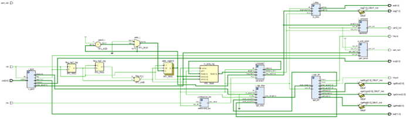
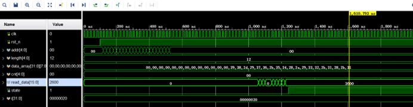

**简体中文 | [English](README.md)**
<div id="top"></div>

[![Contributors][contributors-shield]][contributors-url]
[![Forks][forks-shield]][forks-url]
[![Stargazers][stars-shield]][stars-url]
[![Issues][issues-shield]][issues-url]
[![License][license-shield]][license-url]


<!-- PROJECT LOGO -->
<br />
<div align="center">
    <a href="https://github.com/MoonGrt/FPGA-Calculator">
    
    </a>
<h3 align="center">FPGA-Calculator</h3>
    <p align="center">
    一个能够计算任意带有括号的四则运算式的计算器
    <br />
    <a href="https://github.com/MoonGrt/FPGA-Calculator"><strong>Explore the docs »</strong></a>
    <br />
    <a href="https://github.com/MoonGrt/FPGA-Calculator">View Demo</a>
    ·
    <a href="https://github.com/MoonGrt/FPGA-Calculator/issues">Report Bug</a>
    ·
    <a href="https://github.com/MoonGrt/FPGA-Calculator/issues">Request Feature</a>
    </p>
</div>


<!-- CONTENTS -->
<details open>
  <summary>目录</summary>
  <ol>
    <li><a href="#文件树">文件树</a></li>
    <li>
      <a href="#关于本项目">关于本项目</a>
      <ul>
      </ul>
    </li>
    <li><a href="#贡献">贡献</a></li>
    <li><a href="#许可证">许可证</a></li>
    <li><a href="#联系我们">联系我们</a></li>
    <li><a href="#致谢">致谢</a></li>
  </ol>
</details>


<!-- 文件树 -->
## 文件树

```
└─ Project
  ├─ LICENSE
  ├─ README.md
  ├─ /calculator.cache/
  ├─ /calculator.hw/
  ├─ /calculator.ip_user_files/
  ├─ /calculator.runs/
  ├─ /calculator.sim/
  ├─ /calculator.srcs/
  │ └─ /sources_1/
  │   ├─ /imports/
  │   │ └─ /new/
  │   │   └─ divclk.v
  │   └─ /new/
  │     ├─ debounce_sw.v
  │     ├─ process.v
  │     ├─ process1.v
  │     ├─ uartsend.v
  │     ├─ uart_send.v
  │     ├─ v1.v
  │     ├─ vga_disp.v
  │     ├─ vga_dri.v
  │     ├─ v_ajxd.v
  │     └─ v_disp1.v
  └─ /images/

```


<!-- 关于本项目 -->
## 关于本项目

<p style=" margin-top:0px; margin-bottom:0px; margin-left:0px; margin-right:0px; -qt-block-indent:0; text-indent:0px;">本项目基于Xilinx XC7Z010ICLG225 FPGA，设计并实现了一个可以进行带有任意括号的四则运算的计算器。该计算器能够通过UART接口或矩阵按键输入算式，进行计算后通过VGA接口将计算式及其结果展示在VGA屏幕上。</p>
<p style="-qt-paragraph-type:empty; margin-top:0px; margin-bottom:0px; margin-left:0px; margin-right:0px; -qt-block-indent:0; text-indent:0px;"><br /></p>
<p style=" margin-top:0px; margin-bottom:0px; margin-left:0px; margin-right:0px; -qt-block-indent:0; text-indent:0px;">该项目主要由三个模块组成：输入模块（uart、矩阵按键）、计算模块、VGA屏显示模块。整体RTL框图以及最终仿真结果展示如下：</p>
<p align="center" style=" margin-top:0px; margin-bottom:0px; margin-left:0px; margin-right:0px; -qt-block-indent:0; text-indent:0px;"></p>
<p style="-qt-paragraph-type:empty; margin-top:0px; margin-bottom:0px; margin-left:0px; margin-right:0px; -qt-block-indent:0; text-indent:0px;"><br /></p>
<p align="center" style=" margin-top:0px; margin-bottom:0px; margin-left:0px; margin-right:0px; -qt-block-indent:0; text-indent:0px;"></p>
<p style=" margin-top:0px; margin-bottom:0px; margin-left:0px; margin-right:0px; -qt-block-indent:0; text-indent:0px;">计算模块是本项目的核心部分，负责对用户输入的四则运算表达式进行处理和计算。整个计算流程通过有限状态机（FSM）进行控制，FSM共有五个状态，分别为：空闲状态、复制状态、处理状态、计算状态和结果状态。</p>
<p style=" margin-top:12px; margin-bottom:12px; margin-left:0px; margin-right:0px; -qt-block-indent:0; text-indent:0px;">当用户输入完成后，FSM从空闲状态切换到复制状态。在复制状态下，计算模块将用户输入的计算式从寄存器复制到内部存储，以确保后续处理的稳定性。接着进入处理状态，在该状态下，计算模块识别输入表达式中的数字和运算符（如加、减、乘、除），并将连续的数字字符转换为具体的数值，如将字符'4'和'5'组合成数值45。同时，模块利用两个栈结构，将中缀表达式转换为前缀表达式。表达式转换完成后，FSM进入计算状态，在这一阶段，计算模块根据前缀表达式进行运算，依次从栈中读取操作数和运算符，逐步完成表达式的计算。最后，FSM进入结果状态，将计算结果发送到上层模块，并通过VGA显示器将结果展示给用户。</p>
<p style=" margin-top:12px; margin-bottom:12px; margin-left:0px; margin-right:0px; -qt-block-indent:0; text-indent:0px;">该计算模块通过FSM的有序状态转换，以及利用栈结构实现表达式的解析与计算，有效地解决了括号嵌套及运算优先级等复杂问题，确保了表达式计算的准确性和稳定性。</p></body></html>
<p align="right">(<a href="#top">top</a>)</p>


<!-- 贡献 -->
## 贡献

贡献让开源社区成为了一个非常适合学习、互相激励和创新的地方。你所做出的任何贡献都是**受人尊敬**的。

如果你有好的建议，请复刻（fork）本仓库并且创建一个拉取请求（pull request）。你也可以简单地创建一个议题（issue），并且添加标签「enhancement」。不要忘记给项目点一个 star！再次感谢！

1. 复刻（Fork）本项目
2. 创建你的 Feature 分支 (`git checkout -b feature/AmazingFeature`)
3. 提交你的变更 (`git commit -m 'Add some AmazingFeature'`)
4. 推送到该分支 (`git push origin feature/AmazingFeature`)
5. 创建一个拉取请求（Pull Request）
<p align="right">(<a href="#top">top</a>)</p>


<!-- 许可证 -->
## 许可证

根据 MIT 许可证分发。打开 [LICENSE.txt](LICENSE.txt) 查看更多内容。
<p align="right">(<a href="#top">top</a>)</p>


<!-- 联系我们 -->
## 联系我们

你的名字 - [@twitter_handle](https://twitter.com/twitter_handle) - email@email_client.com

项目链接: [https://github.com/github_username/repo_name](https://github.com/github_username/repo_name)
<p align="right">(<a href="#top">top</a>)</p>


<!-- 致谢 -->
## 致谢

在这里列出你觉得有用的资源，并以此致谢。我已经添加了一些我喜欢的资源，以便你可以快速开始！

* [Choose an Open Source License](https://choosealicense.com)
* [GitHub Emoji Cheat Sheet](https://www.webpagefx.com/tools/emoji-cheat-sheet)
* [Malven's Flexbox Cheatsheet](https://flexbox.malven.co/)
* [Malven's Grid Cheatsheet](https://grid.malven.co/)
* [Img Shields](https://shields.io)
* [GitHub Pages](https://pages.github.com)
* [Font Awesome](https://fontawesome.com)
* [React Icons](https://react-icons.github.io/react-icons/search)
<p align="right">(<a href="#top">top</a>)</p>


<!-- MARKDOWN LINKS & IMAGES -->
<!-- https://www.markdownguide.org/basic-syntax/#reference-style-links -->
[contributors-shield]: https://img.shields.io/github/contributors/MoonGrt/FPGA-Calculator.svg?style=for-the-badge
[contributors-url]: https://github.com/MoonGrt/FPGA-Calculator/graphs/contributors
[forks-shield]: https://img.shields.io/github/forks/MoonGrt/FPGA-Calculator.svg?style=for-the-badge
[forks-url]: https://github.com/MoonGrt/FPGA-Calculator/network/members
[stars-shield]: https://img.shields.io/github/stars/MoonGrt/FPGA-Calculator.svg?style=for-the-badge
[stars-url]: https://github.com/MoonGrt/FPGA-Calculator/stargazers
[issues-shield]: https://img.shields.io/github/issues/MoonGrt/FPGA-Calculator.svg?style=for-the-badge
[issues-url]: https://github.com/MoonGrt/FPGA-Calculator/issues
[license-shield]: https://img.shields.io/github/license/MoonGrt/FPGA-Calculator.svg?style=for-the-badge
[license-url]: https://github.com/MoonGrt/FPGA-Calculator/blob/master/LICENSE

